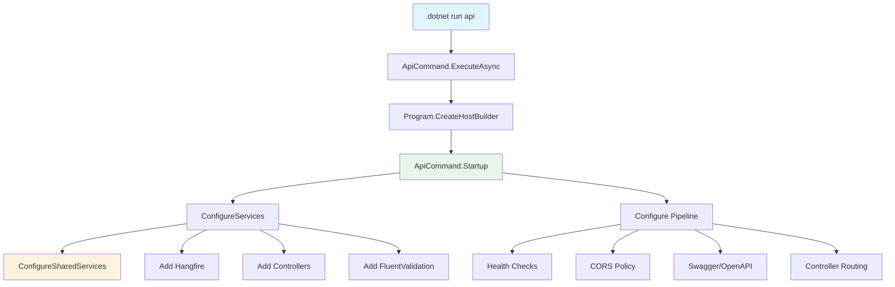
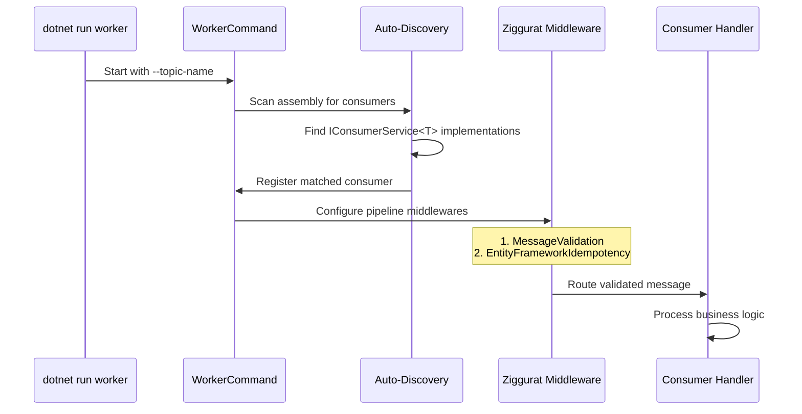
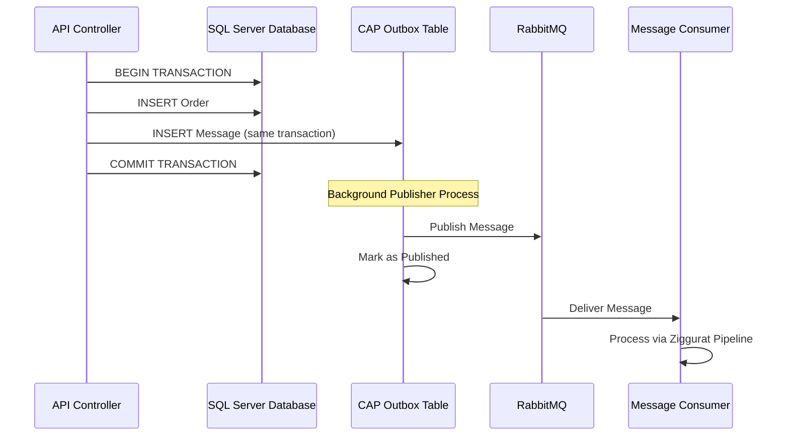
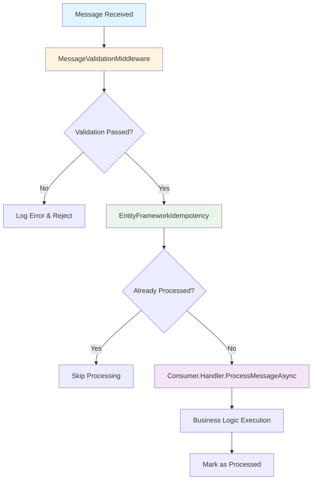
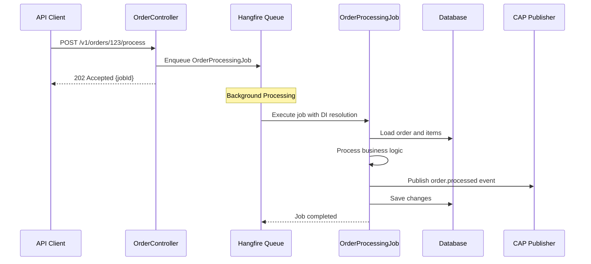
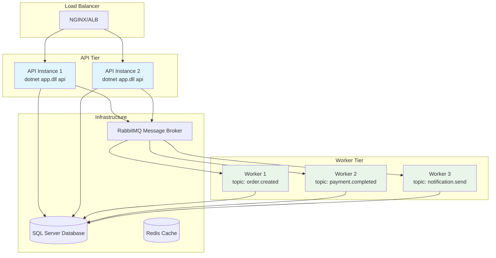
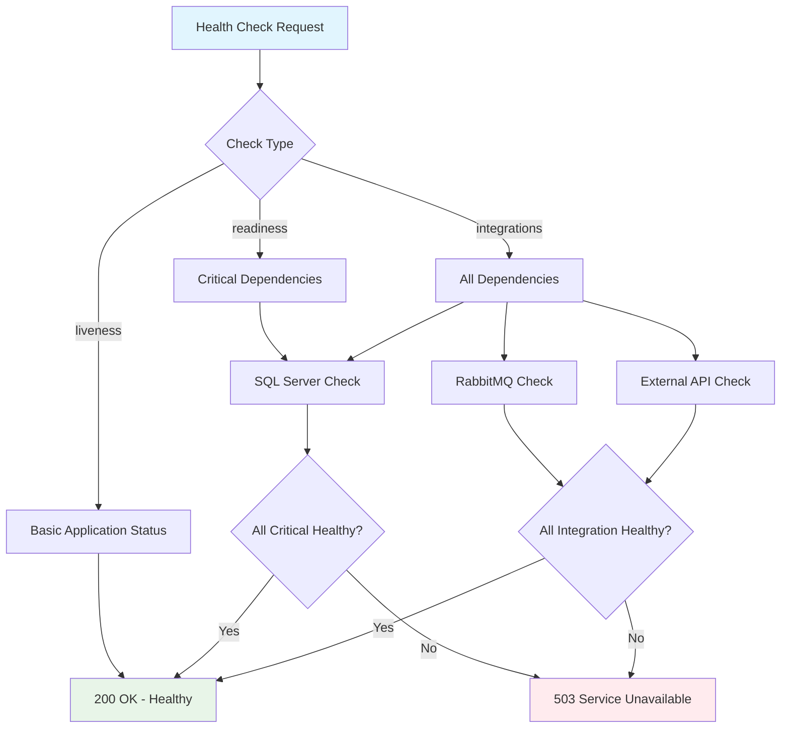
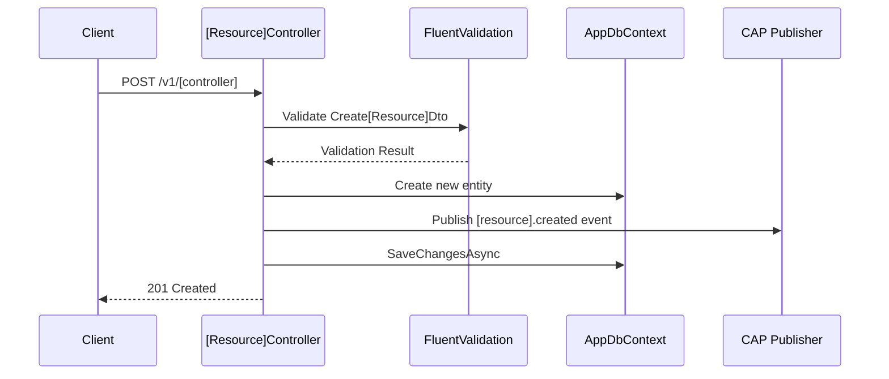
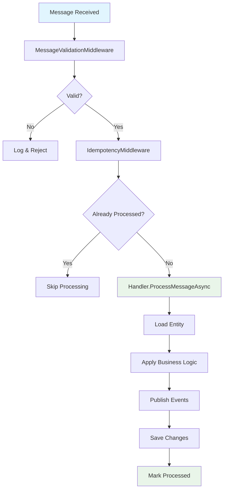

---

name: "dotnet-documenter"
description: "**DOTNET TECHNICAL DOCUMENTER** — Specialized skill for creating comprehensive markdown documentation of juntossomosmais .NET/C# applications with integrated Mermaid diagrams. USE FOR: architectural documentation; API documentation with workflow diagrams; CliFx command documentation; Entity Framework model documentation; CAP messaging flow documentation; Hangfire job documentation; integration documentation; onboarding guides; technical specifications; deployment documentation; troubleshooting guides. PROVIDES: professional markdown documentation; integrated Mermaid diagrams (flowcharts, sequence, architecture); code examples and patterns; architectural decision records; comprehensive API documentation; deployment guides. JUNTOSSOMOSMAIS FOCUS: Documents StandardEntity patterns, CliFx command architecture, CAP messaging flows, Entity Framework Core configurations, Hangfire background processing, FluentValidation patterns, and ASP.NET Core security following company documentation standards."
---

# .NET Technical Documenter Skill

*Professional technical documentation with integrated diagrams for juntossomosmais .NET applications*

## Purpose

This skill creates comprehensive, professional documentation for .NET/C# applications, integrating visual diagrams with detailed technical content. Designed to work with `dotnet-explorer` and `dotnet-analyzer` to create complete project documentation following juntossomosmais standards.

## Core Capabilities

### Documentation Types

- **Architectural Documentation**: CliFx command structure, Entity Framework design, CAP messaging architecture
- **API Documentation**: Controller specifications, authentication flows, request/response examples
- **Business Logic Documentation**: Complex workflows, validation rules, background job processing
- **Integration Documentation**: External services, messaging patterns, health check systems
- **Deployment Documentation**: Environment setup, configuration, CliFx command deployment
- **Troubleshooting Guides**: Common issues, debugging procedures, error resolution

### Visual Integration

- **Architecture Diagrams**: CliFx commands, Entity Framework relationships, service interactions
- **Sequence Diagrams**: API request flows, CAP messaging sequences, background job processing
- **Flowcharts**: Business logic, validation chains, error handling flows
- **Mindmaps**: Knowledge organization, troubleshooting guides, feature planning
- **Technical Diagrams**: Database schemas, message flows, deployment architecture

### Content Generation

- **Code Examples**: Controller patterns, Entity Framework usage, CAP consumer implementation
- **Configuration Guides**: appsettings.json setup, connection strings, environment configuration
- **API Specifications**: Complete endpoint documentation with examples and validation rules
- **Architectural Decisions**: ADR format documentation with rationale and implications
- **Onboarding Documentation**: Developer guides, setup procedures, workflow explanations

## juntossomosmais Documentation Patterns

### CliFx Command Architecture Documentation

#### ApiCommand Documentation

````markdown
# API Command Architecture

## Command Structure

The `ApiCommand` serves as the primary entry point for the web API, implementing the CliFx pattern for command-line interface management.

```csharp
[Command("api")]
public class ApiCommand : ICommand
{
    public async ValueTask ExecuteAsync(IConsole console)
        => await Program.CreateHostBuilder(Array.Empty<string>()).Build().RunAsync();

    public class Startup
    {
        public void ConfigureServices(IServiceCollection services)
        {
            // Shared services registration
            services.ConfigureSharedServices(_configuration);

            // Hangfire for background jobs
            services.AddHangfire(config => config.UseSqlServerStorage(connectionString));
            services.AddHangfireServer();

            // FluentValidation for request validation
            services.AddScoped<IValidator<CreatePersonDto>, CreatePersonValidation>();
        }

        public void Configure(IApplicationBuilder app, IWebHostEnvironment env)
        {
            // Health check endpoints
            app.UseHealthChecks("/api/healthcheck/liveness");
            app.UseHealthChecks("/api/healthcheck/readiness");
            app.UseHealthChecks("/api/healthcheck/integrations");
        }
    }
}
```

## Command Flow Architecture

````

#### WorkerCommand Documentation

````markdown
# Worker Command Architecture

## Consumer Host Pattern

The `WorkerCommand` hosts CAP message consumers, implementing auto-discovery and registration patterns.

```csharp
[Command("worker")]
public class WorkerCommand : ICommand
{
    public class Startup
    {
        public void ConfigureServices(IServiceCollection services)
        {
            services.ConfigureSharedServices(_configuration);

            // FluentValidation for message DTOs
            services.AddScoped<IValidator<OrderCreatedMessage>, OrderCreatedMessageValidation>();

            // Auto-discovered consumer registration
            CurrentEntry?.Register(services);
        }
    }
}
```

## Consumer Auto-Discovery Flow

````

### CAP Messaging Documentation

#### Transactional Outbox Pattern Documentation

````markdown
# CAP Messaging - Transactional Outbox Pattern

## Implementation

The CAP framework provides transactional outbox pattern implementation, ensuring message delivery guarantees alongside database operations.

```csharp
public class OrderService
{
    private readonly AppDbContext _context;
    private readonly ICapPublisher _capBus;

    public async Task CreateOrderAsync(CreateOrderDto dto)
    {
        using var transaction = await _context.Database.BeginTransactionAsync();

        // Create order in database
        var order = new Order { /* properties */ };
        _context.Orders.Add(order);

        // Publish message within same transaction
        await _capBus.PublishAsync("order.created", new OrderCreatedMessage
        {
            OrderId = order.Id.ToString(),
            CustomerId = order.CustomerId,
            MessageId = Guid.NewGuid().ToString(),
            MessageGroup = "order-processing"
        });

        await _context.SaveChangesAsync();
        await transaction.CommitAsync();
    }
}
```

## Transactional Outbox Flow

````

#### Consumer Pattern Documentation

````markdown
# CAP Consumer Implementation Pattern

## Consumer Structure

All CAP consumers follow a standardized pattern with rigid outer class and flexible handler implementation.

```csharp
public class OrderCreatedConsumer : ICapSubscribe
{
    private readonly IConsumerService<OrderCreatedMessage> _consumerService;

    public OrderCreatedConsumer(IConsumerService<OrderCreatedMessage> consumerService)
        => _consumerService = consumerService;

    [CapSubscribe(Topics.OrderCreated, Group = Groups.OrderProcessing)]
    public async Task HandleAsync(OrderCreatedMessage message)
        => await _consumerService.ProcessMessageAsync(message);

    public class Handler : IConsumerService<OrderCreatedMessage>
    {
        private readonly AppDbContext _context;
        private readonly ICapPublisher _capBus;

        public Handler(AppDbContext context, ICapPublisher capBus)
        {
            _context = context;
            _capBus = capBus;
        }

        public async Task ProcessMessageAsync(OrderCreatedMessage message)
        {
            // Idempotency handled by Ziggurat middleware
            var order = await _context.Orders
                .FirstOrDefaultAsync(o => o.Id == message.OrderId);

            if (order == null) return; // Already processed

            // Complex business logic
            await ProcessOrderValidation(order);
            await PublishSubsequentEvents(order);

            await _context.SaveChangesAsync();
        }
    }
}
```

## Consumer Middleware Pipeline

````

### Entity Framework Documentation

#### StandardEntity Pattern Documentation

````markdown
# Entity Framework - StandardEntity Pattern

## Base Entity Implementation

All entities inherit from `StandardEntity`, providing consistent audit fields and automatic timestamp management.

```csharp
public abstract class StandardEntity
{
    public int Id { get; set; }
    public DateTime CreatedAt { get; set; }
    public DateTime UpdatedAt { get; set; }
}

public class Order : StandardEntity
{
    public string CustomerName { get; set; }
    public decimal Amount { get; set; }
    public OrderStatus Status { get; set; }

    // Navigation properties
    public ICollection<OrderItem> Items { get; set; }
}
```

## DbContext Configuration

```csharp
public class AppDbContext : DbContext
{
    protected override void OnModelCreating(ModelBuilder modelBuilder)
    {
        // Entity configurations
        modelBuilder.Entity<Order>(entity =>
        {
            entity.Property(e => e.CustomerName)
                .IsRequired()
                .HasMaxLength(100);

            entity.HasMany(e => e.Items)
                .WithOne(e => e.Order)
                .HasForeignKey(e => e.OrderId);
        });

        // CAP message tracking
        modelBuilder.MapMessageTracker();
    }

    public override async Task<int> SaveChangesAsync(CancellationToken cancellationToken = default)
    {
        AutomaticallyAddCreatedAndUpdatedAt();
        return await base.SaveChangesAsync(cancellationToken);
    }
}
```

## Entity Lifecycle Diagram
```mermaid
flowchart LR
    A[Entity Created] --> B[Set CreatedAt]
    B --> C[Set UpdatedAt]
    C --> D[Save to Database]

    E[Entity Modified] --> F[Update UpdatedAt]
    F --> G[Save Changes]

    H[Entity Queried] --> I{Include .AsNoTracking()?}
    I -->|Yes| J[No Change Tracking]
    I -->|No| K[Track for Updates]

    style A fill:#e8f5e8
    style E fill:#fff3e0
    style H fill:#e1f5fe
```
````

### Hangfire Job Documentation

#### Background Job Pattern Documentation

````markdown
# Hangfire Background Jobs

## Job Implementation Pattern

All Hangfire jobs follow a consistent pattern with single responsibility and dependency injection.

```csharp
namespace DotNetTemplate.Jobs;

public class OrderProcessingJob
{
    private readonly AppDbContext _context;
    private readonly ICapPublisher _capBus;
    private readonly ILogger<OrderProcessingJob> _logger;

    public OrderProcessingJob(
        AppDbContext context,
        ICapPublisher capBus,
        ILogger<OrderProcessingJob> logger)
    {
        _context = context;
        _capBus = capBus;
        _logger = logger;
    }

    public async Task ExecuteAsync(int orderId, OrderProcessingOptions options)
    {
        try
        {
            var order = await _context.Orders
                .Include(o => o.Items)
                .FirstOrDefaultAsync(o => o.Id == orderId);

            if (order == null)
            {
                _logger.LogWarning("Order {OrderId} not found for processing", orderId);
                return;
            }

            await ProcessOrderLogic(order, options);

            // Publish completion event
            await _capBus.PublishAsync("order.processed", new OrderProcessedMessage
            {
                OrderId = order.Id.ToString(),
                ProcessedAt = DateTime.UtcNow,
                MessageId = Guid.NewGuid().ToString()
            });

            await _context.SaveChangesAsync();
        }
        catch (Exception ex)
        {
            _logger.LogError(ex, "Failed to process order {OrderId}", orderId);
            throw; // Hangfire will handle retries
        }
    }
}
```

## Job Enqueueing Pattern

```csharp
[ApiController]
[Route("v1/[controller]")]
public class OrderController : ControllerBase
{
    private readonly IBackgroundJobClient _backgroundJobs;

    [HttpPost("{id}/process")]
    public async Task<IActionResult> ProcessOrderAsync(int id, [FromBody] ProcessOrderRequest request)
    {
        // Enqueue background job
        var jobId = _backgroundJobs.Enqueue<OrderProcessingJob>(
            job => job.ExecuteAsync(id, request.ToOptions()));

        return Accepted(new { jobId });
    }
}
```

## Job Processing Flow

````

## Advanced Documentation Features

### CliFx Command Deployment Documentation

````markdown
# Deployment Architecture

## Command Deployment Strategy

Each CliFx command is deployed independently, allowing for scalable and maintainable service architecture.

```bash
# API Server Deployment
dotnet DotNetTemplate.dll api

# Consumer Worker Deployment (per topic)
dotnet DotNetTemplate.dll worker --topic-name order.created
dotnet DotNetTemplate.dll worker --topic-name payment.completed

# Data Seeding
dotnet DotNetTemplate.dll seed --environment Production
```

## Deployment Architecture Diagram

````

### Health Check System Documentation

````markdown
# Health Check System

## Health Check Endpoints

The application provides multiple health check endpoints for different monitoring scenarios.

### Liveness Check
- **Endpoint**: `/api/healthcheck/liveness`
- **Purpose**: Determines if the application is running
- **Checks**: Basic application responsiveness
- **Usage**: Kubernetes liveness probes, basic monitoring

### Readiness Check  
- **Endpoint**: `/api/healthcheck/readiness`
- **Purpose**: Determines if the application can handle requests
- **Checks**: Critical dependencies (database, essential services)
- **Usage**: Kubernetes readiness probes, load balancer health

### Integration Check
- **Endpoint**: `/api/healthcheck/integrations`
- **Purpose**: Complete dependency health assessment
- **Checks**: All external dependencies (database, RabbitMQ, external APIs)
- **Usage**: Comprehensive monitoring, troubleshooting

## Custom Health Check Implementation

```csharp
public class RabbitMQHealthCheck : IHealthCheck
{
    private readonly Uri _uri;

    public RabbitMQHealthCheck(Uri uri)
    {
        ArgumentNullException.ThrowIfNull(uri);
        _uri = uri;
    }

    public async Task<HealthCheckResult> CheckHealthAsync(
        HealthCheckContext context,
        CancellationToken cancellationToken = default)
    {
        try
        {
            var factory = new ConnectionFactory { Uri = _uri };
            await using var connection = await factory.CreateConnectionAsync(cancellationToken);
            await using var channel = await connection.CreateChannelAsync(cancellationToken: cancellationToken);
            return HealthCheckResult.Healthy("RabbitMQ connection successful");
        }
        catch (Exception ex)
        {
            return new HealthCheckResult(
                context.Registration.FailureStatus,
                exception: ex,
                description: "RabbitMQ connection failed");
        }
    }
}
```

## Health Check Flow Diagram

````

## Documentation Templates

### API Controller Template

````markdown
# [Controller Name] API Documentation

## Controller Overview
- **Route**: `v1/[controller]`
- **Authentication**: Required
- **Authorization**: [Specify policies]

## Endpoints

### Create [Resource]
- **Method**: `POST`
- **Route**: `/v1/[controller]`
- **Request Body**: `Create[Resource]Dto`
- **Response**: `201 Created` with created resource
- **Validation**: `Create[Resource]Validation`

#### Request Example
```json
{
  "name": "Example Resource",
  "description": "Resource description",
  "amount": 100.50
}
```

#### Response Example
```json
{
  "id": 123,
  "name": "Example Resource",
  "description": "Resource description",
  "amount": 100.50,
  "createdAt": "2024-03-24T10:30:00Z",
  "updatedAt": "2024-03-24T10:30:00Z"
}
```

## Implementation Flow


## Error Responses

### Validation Errors (400)
```json
{
  "type": "https://tools.ietf.org/html/rfc7231#section-6.5.1",
  "title": "One or more validation errors occurred.",
  "status": 400,
  "errors": {
    "Name": ["The field [name] cannot be empty or null"]
  }
}
```
````

### CAP Consumer Template

````markdown
# [Event] Consumer Documentation

## Consumer Overview
- **Topic**: `[source].[domain].[event]`
- **Group**: `[app].[domain].[event]`
- **Auto-Discovery**: ✅ Enabled
- **Validation**: `[Event]MessageValidation`

## Message Schema

### [Event]Message
```csharp
public class [Event]Message : IMessage
{
    public string EntityId { get; set; }
    public DateTime EventTime { get; set; }
    public [EventData] Data { get; set; }

    // Required by IMessage
    public string MessageId { get; set; }
    public string MessageGroup { get; set; }
}
```

## Business Logic

### Handler Implementation
```csharp
public class Handler : IConsumerService<[Event]Message>
{
    private readonly AppDbContext _context;
    private readonly ICapPublisher _capBus;

    public async Task ProcessMessageAsync([Event]Message message)
    {
        // Idempotency automatically handled by Ziggurat

        // Load related entities
        var entity = await _context.[Entities]
            .FirstOrDefaultAsync(e => e.Id == message.EntityId);

        if (entity == null)
        {
            _logger.LogWarning("Entity {EntityId} not found", message.EntityId);
            return;
        }

        // Process business logic
        await ProcessBusinessRule(entity, message.Data);

        // Publish subsequent events if needed
        await _capBus.PublishAsync("subsequent.event", new SubsequentEventMessage
        {
            // Event data
        });

        await _context.SaveChangesAsync();
    }
}
```

## Processing Flow

````

## Integration with juntossomosmais Infrastructure

### Documentation Standards

- **Consistent Structure**: Hierarchical organization with standardized section headers
- **Code Examples**: Real implementation patterns from dotnet-template
- **Visual Diagrams**: Mermaid integration for complex flow documentation
- **Troubleshooting**: Common issues and resolution procedures
- **Deployment Guidance**: CliFx command deployment and scaling strategies

### Quality Assurance

- **Technical Accuracy**: Code examples validated against working implementations
- **Visual Clarity**: Mermaid diagrams for complex architectural concepts
- **Practical Examples**: Real-world scenarios and usage patterns
- **Maintenance Process**: Version control integration and regular updates
- **Cross-Reference Validation**: Consistent linking between related documentation

---

*"Transform complex juntossomosmais .NET architecture into clear, actionable documentation"*
