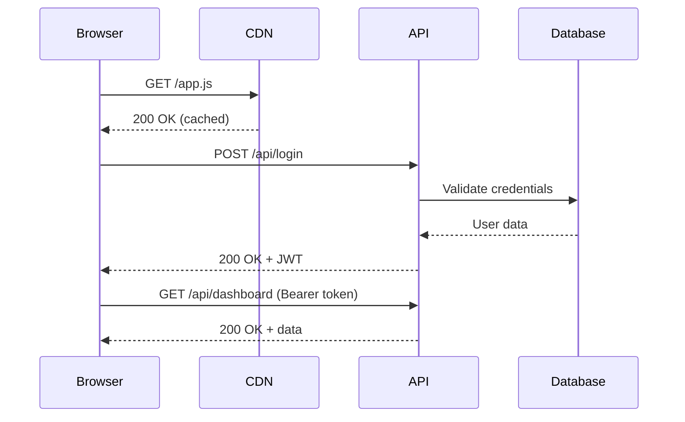
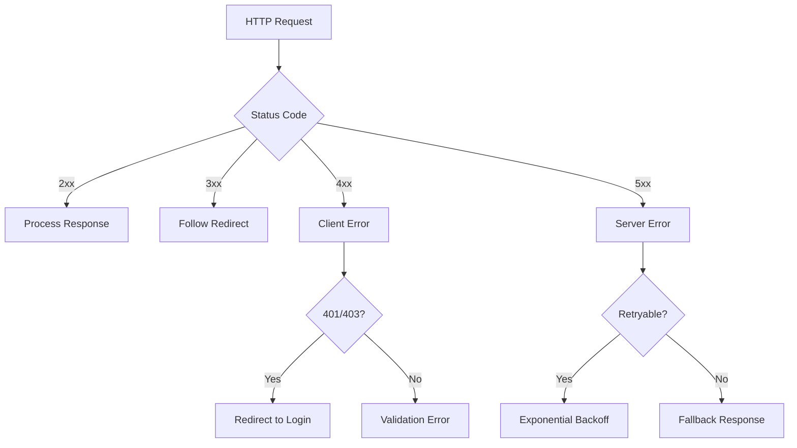
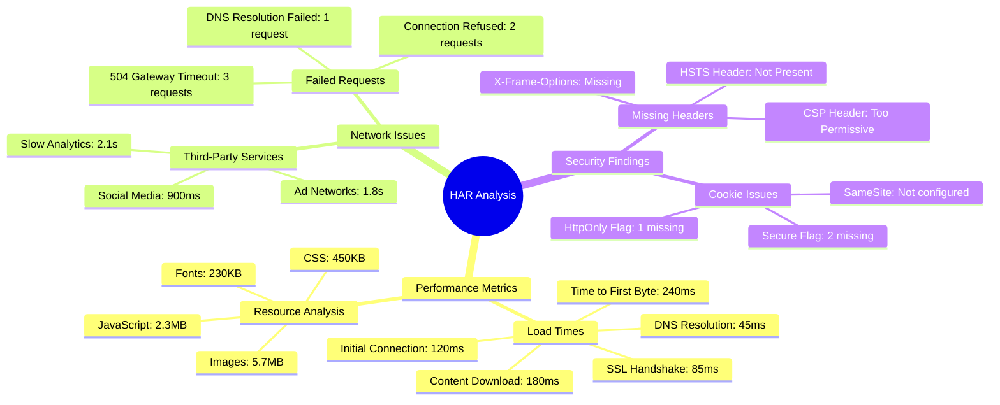
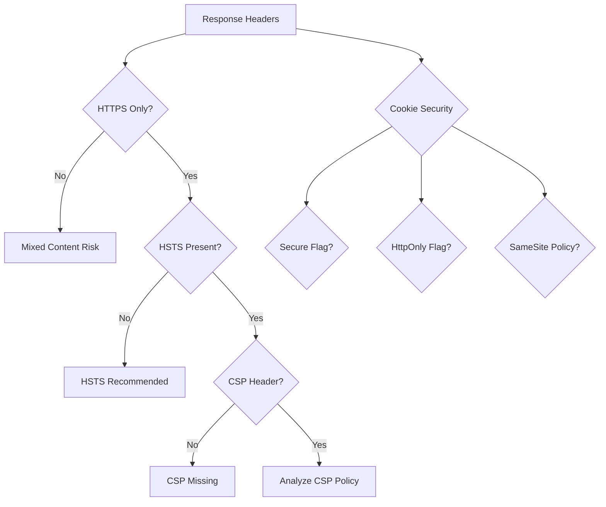

# HAR Analysis Skill

*Expert analysis of HTTP Archive files for performance, debugging, and security insights*

## Purpose

This skill specializes in analyzing HTTP Archive (HAR) files exported from browser developer tools to provide deep insights into web application performance, identify bottlenecks, debug API issues, and generate visual representations of network behavior through Mermaid diagrams.

## CRITICAL REQUIREMENTS (March 2026 Anti-Hallucination)

### STOP Conditions (MANDATORY)
```python
# When HAR file is invalid or corrupted, STOP and ask user
if not valid_har_file(har_file_path):
    raise SkillExecutionStop(
        reason="INVALID_HAR_FILE",
        message="🚫 STOP: Arquivo HAR inválido ou corrompido.\n\n❓ Favor fornecer arquivo HAR válido exportado do DevTools (F12 > Network > Export HAR).",
        user_action_required=True
    )

# When analysis scope is unclear, ask user for focus
if analysis_scope_unclear():
    questions = [{
        "header": "analysis_focus",
        "question": "🔍 Foco da análise HAR não está claro. Qual área investigar?", 
        "options": [
            {"label": "Performance e bottlenecks", "value": "performance"},
            {"label": "Erros de API e debugging", "value": "debugging"},
            {"label": "Audit de segurança", "value": "security"},
            {"label": "Análise completa", "value": "comprehensive"}
        ]
    }]
    user_response = vscode_askQuestions(questions)
    analysis_focus = user_response["analysis_focus"]

# When HAR file is too large for processing, STOP and ask user
if har_file_too_large():
    raise SkillExecutionStop(
        reason="HAR_FILE_TOO_LARGE",
        message="🚫 STOP: Arquivo HAR muito grande para processamento.\n\n❓ Filtrar período específico ou continuar com análise limitada?",
        user_action_required=True
    )
```

## Core Capabilities

### HAR File Structure Understanding

#### Main Sections
- **Log**: Root container with version and creator info
- **Pages**: Page load events and timing information  
- **Entries**: Individual HTTP requests/responses with full details
- **Creator/Browser**: Tool and version information

#### Entry Details Analyzed
- **Request**: URL, method, headers, cookies, POST data, query parameters
- **Response**: Status code, headers, content, redirectURL
- **Cache**: beforeRequest, afterRequest cache states
- **Timings**: DNS, connect, send, wait, receive, SSL timing breakdown
- **Security**: TLS version, cipher suite, certificate information

### Analysis Types Supported

#### Performance Analysis
- **Load Time Breakdown**: DNS, connection, request, response timing analysis
- **Resource Waterfall**: Sequential loading patterns and dependencies
- **Critical Path Analysis**: Blocking resources and render-critical requests
- **Third-Party Impact**: External service performance and loading behavior
- **Cache Effectiveness**: Hit/miss ratios and caching strategy evaluation
- **Bundle Analysis**: JavaScript/CSS file sizes and loading patterns

#### API Debugging
- **Request Patterns**: API call sequences and dependencies
- **Error Analysis**: 4xx/5xx responses with context and frequency
- **Authentication Flows**: OAuth, JWT, session management patterns
- **Data Flow Mapping**: Request/response payload analysis
- **Rate Limiting Detection**: 429 responses and retry patterns
- **CORS Issues**: Cross-origin request problems and headers

#### Security Assessment  
- **Header Security**: HTTPS, HSTS, CSP, X-Frame-Options analysis
- **Cookie Security**: HttpOnly, Secure, SameSite attribute review
- **Mixed Content**: HTTP resources loaded on HTTPS pages
- **Certificate Validation**: TLS/SSL certificate chain analysis
- **Data Exposure**: Sensitive information in URLs or responses
- **Third-Party Tracking**: Analytics and advertising network identification

### Mermaid Diagram Generation

#### Sequence Diagrams for Request Flows


#### Flowchart for Error Handling


#### Mindmap for Performance Insights  


## Advanced Analysis Capabilities

### Performance Metrics Calculation

#### Core Web Vitals Detection
- **Largest Contentful Paint (LCP)**: Identify main content rendering
- **First Input Delay (FID)**: Calculate interaction responsiveness  
- **Cumulative Layout Shift (CLS)**: Measure visual stability
- **First Contentful Paint (FCP)**: Track initial rendering
- **Time to Interactive (TTI)**: Determine page readiness

#### Resource Loading Analysis
```javascript
// Example analysis output
{
  "totalRequests": 127,
  "totalSize": "8.9 MB",
  "loadTime": "3.2s",
  "criticalPath": [
    {"url": "/index.html", "timing": 240, "blocking": true},
    {"url": "/app.css", "timing": 180, "blocking": true},
    {"url": "/app.js", "timing": 420, "blocking": true}
  ],
  "thirdPartyImpact": {
    "googleAnalytics": "180ms",
    "facebookPixel": "240ms", 
    "adNetworks": "890ms"
  }
}
```

### Request Pattern Analysis

#### API Call Sequences
- **Authentication Flows**: Login → Token refresh → Protected resource access
- **Data Dependencies**: User info → Permissions → Dashboard data
- **Pagination Patterns**: List requests with offset/limit parameters
- **Search Workflows**: Input debouncing and query optimization
- **File Upload Flows**: Multipart form data and progress tracking

#### Error Pattern Recognition
- **Failed Authentication**: 401 → Login prompt → Retry sequence
- **Rate Limiting**: 429 → Backoff → Retry with exponential delay
- **Service Unavailable**: 503 → Circuit breaker → Fallback response
- **Timeout Patterns**: Request timeouts and client-side retries
- **CORS Failures**: Preflight failures and cross-origin issues

### Security Analysis Framework

#### Header Security Assessment


#### Data Flow Security
- **Sensitive Data Exposure**: Credit cards, SSNs, passwords in URLs/responses  
- **Token Management**: JWT expiration, refresh patterns, secure storage
- **Session Security**: Session fixation, CSRF protection, timeout handling
- **Input Validation**: Parameter tampering attempts and validation bypasses
- **Certificate Analysis**: Chain validation, expiration warnings, weak algorithms

## Common Use Cases & Examples

### 1. Performance Debugging
```
Scenario: "Why is my page loading slowly?"

Analysis Output:
- Blocking resources identified: 3 render-blocking CSS files
- Third-party impact: Google Fonts adding 800ms delay
- Oversized images: 12 images >1MB without compression
- Unused JavaScript: 2.1MB of unused code detected
- CDN misses: 15 resources not cached properly

Mermaid Waterfall Sequence Generated:
- Shows timeline of resource loading
- Highlights critical path dependencies
- Identifies optimization opportunities
```

### 2. API Debugging  
```
Scenario: "API calls are failing intermittently"

Analysis Output:  
- Error rate: 15% (mostly 504 timeouts)
- Failed endpoints: /api/search (8 failures), /api/user (3 failures)  
- Timing pattern: Failures correlate with >5s response times
- Authentication: 2 requests failed due to expired tokens
- Retry behavior: No exponential backoff detected

Mermaid Flow Diagram Generated:
- Shows request/retry patterns
- Highlights error scenarios
- Suggests resilience improvements
```

### 3. Security Audit
```
Scenario: "Security review of network traffic"

Analysis Output:
- Mixed content: 5 HTTP resources on HTTPS page
- Missing security headers: HSTS, CSP, X-Frame-Options
- Insecure cookies: 3 cookies without Secure flag
- Sensitive data: API keys visible in query parameters  
- Third-party trackers: 12 different analytics/advertising domains

Mermaid Security Mindmap Generated:
- Organizes findings by severity
- Shows relationships between issues
- Provides remediation roadmap
```

### 4. Third-Party Service Analysis
```
Scenario: "Which third-party services are impacting performance?"

Analysis Output:
- Google Analytics: 180ms average, 99% success rate
- Facebook Pixel: 240ms average, 95% success rate  
- Ad Networks: 890ms average, 85% success rate (concerning)
- CDN Performance: 45ms average, 99.5% success rate (excellent)
- External APIs: 1.2s average, 92% success rate

Mermaid Service Comparison Chart Generated:
- Visual comparison of service performance
- Highlights problematic dependencies  
- Suggests optimization priorities
```

## Integration & Workflow

### HAR File Import Process
1. **File Validation**: Verify HAR format and structure integrity
2. **Data Parsing**: Extract entries, timing, and metadata
3. **Initial Analysis**: Calculate basic metrics and identify patterns
4. **Detailed Investigation**: Deep dive into specific areas of concern
5. **Visualization**: Generate appropriate Mermaid diagrams
6. **Reporting**: Summarize findings with actionable recommendations

### Analysis Query Examples
- "Show me all requests that took longer than 2 seconds"
- "What's causing the 404 errors in this HAR file?"
- "Generate a sequence diagram of the login flow"
- "Which third-party services are the slowest?"
- "Are there any security issues with the cookies?"
- "Create a mindmap of performance bottlenecks"

### Mermaid Integration Workflow
1. **Analyze HAR data** for relevant patterns
2. **Choose appropriate diagram type** (sequence/flowchart/mindmap)
3. **Extract key information** for visualization
4. **Generate Mermaid code** using specialized skills
5. **Validate syntax** with mermaid-diagram-validator
6. **Preview output** with mermaid-diagram-preview

## Best Practices

### Analysis Accuracy
- Validate HAR file integrity before processing
- Consider browser differences in timing measurements
- Account for network conditions during capture
- Separate client-side vs server-side performance issues
- Cross-reference with server logs when available

### Visualization Guidelines  
- Use sequence diagrams for request/response flows
- Use flowcharts for decision trees and error handling
- Use mindmaps for organizing complex findings
- Include timing information in visualizations
- Highlight critical path and bottlenecks clearly

### Security Considerations
- Never expose sensitive data in analysis outputs
- Sanitize URLs and headers before sharing diagrams
- Flag potential data leakage in findings
- Consider GDPR/privacy implications of logged data
- Recommend secure alternatives for identified issues

## Tools Integration

### File Processing
- JSON parsing and validation
- Large file handling (>100MB HAR files)
- Batch processing of multiple HAR files
- Export capabilities for analysis results

### Mermaid Integration
- Automatic diagram type selection based on analysis goals
- Custom styling for performance/security themes
- Interactive elements for detailed drill-down
- Integration with existing documentation workflows

---

*"HAR files tell the complete story of web performance - this skill helps you understand the plot"*