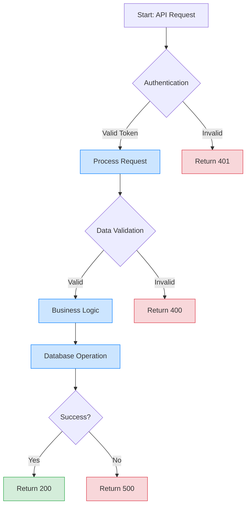
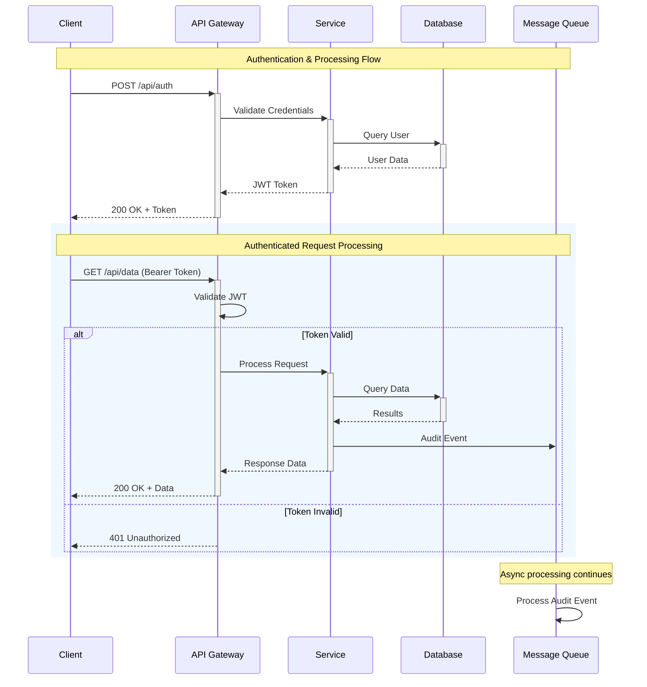
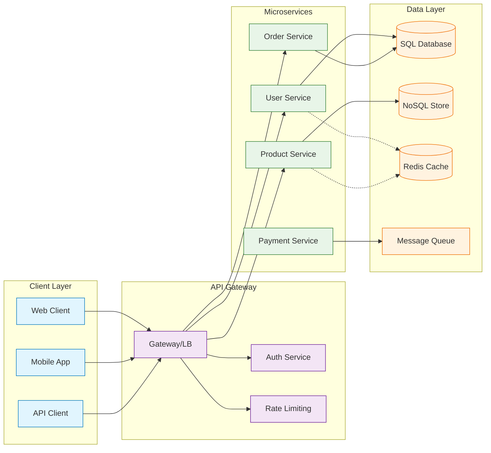
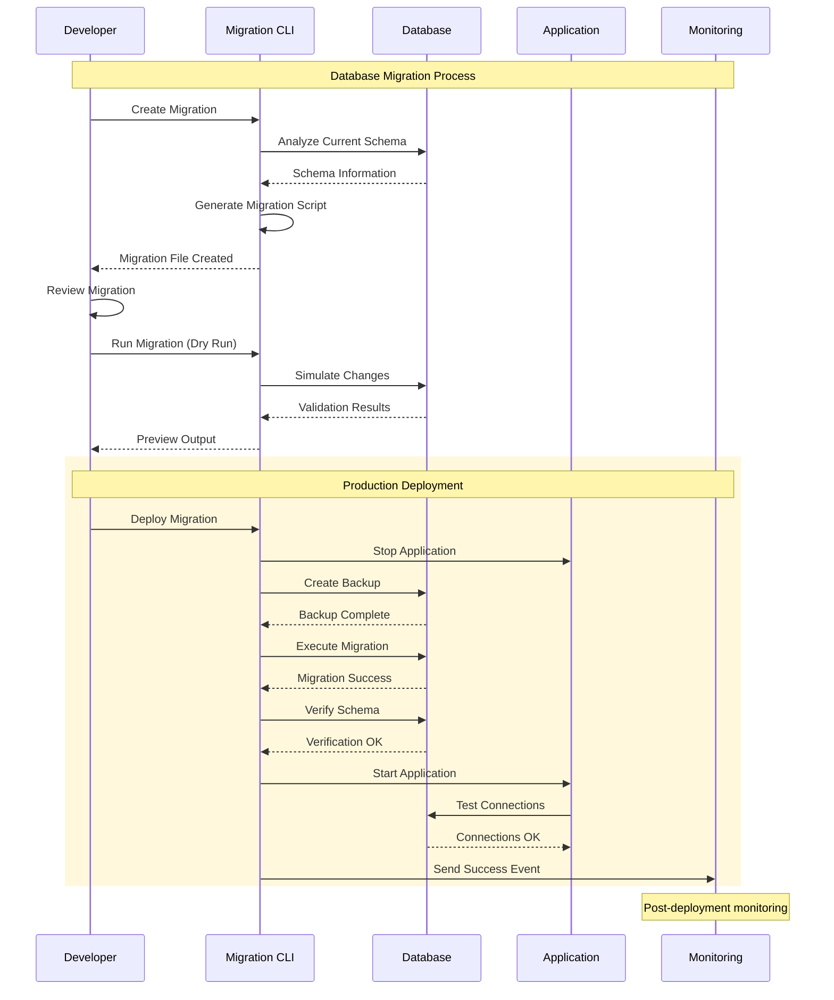
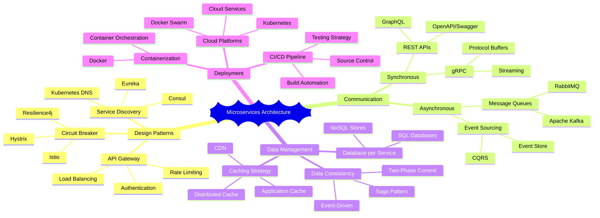
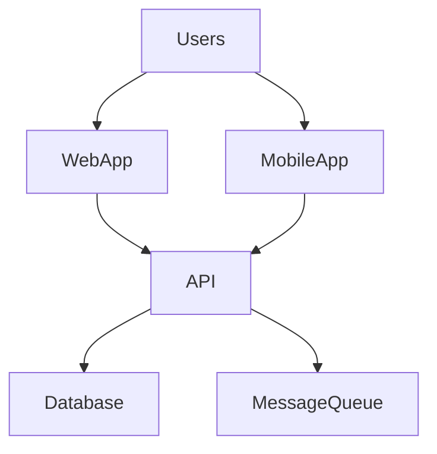
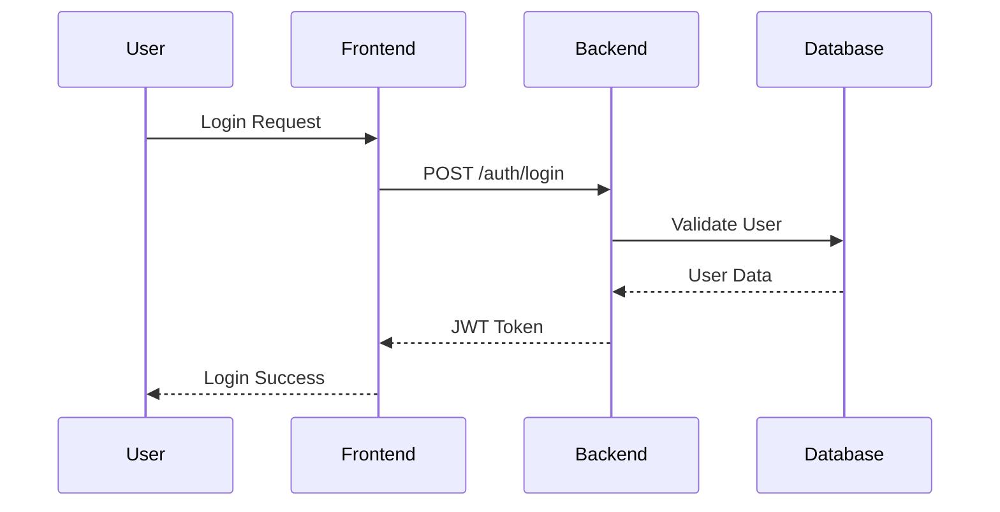
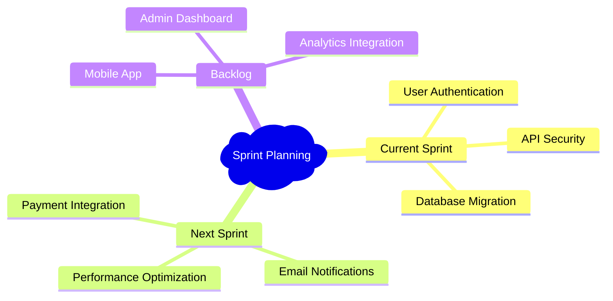
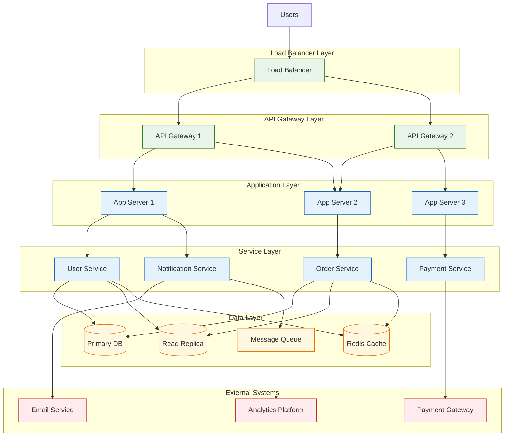

# Mermaid Diagram Expert Skill

*Comprehensive Mermaid diagram creation with technical focus*

## Purpose

This skill provides complete Mermaid diagramming expertise, combining flowchart, sequence diagram, mindmap, and advanced diagram capabilities into a unified, powerful visualization tool. Designed specifically for technical documentation, system design, and software development workflows with deep understanding of all Mermaid diagram types.

## CRITICAL REQUIREMENTS (March 2026 Anti-Hallucination)

### STOP Conditions (MANDATORY)

```python
# When diagram requirements are unclear, STOP and ask user
if diagram_requirements_unclear():
    questions = [{
        "header": "diagram_clarification",
        "question": "🎨 Requerimentos do diagrama Mermaid não estão claros. Que tipo de diagrama criar?",
        "options": [
            {"label": "Fluxograma de processo/sistema", "value": "flowchart"},
            {"label": "Diagrama de sequência (interações)", "value": "sequence"},
            {"label": "Mapa mental/hierárquico", "value": "mindmap"},
            {"label": "Diagrama customizado", "value": "custom"}
        ],
        "allowFreeformInput": True
    }]
    user_response = vscode_askQuestions(questions)
    diagram_type = user_response["diagram_clarification"]

# When technical context is missing, STOP and gather context
if technical_context_missing():
    raise SkillExecutionStop(
        reason="TECHNICAL_CONTEXT_MISSING",
        message="🚫 STOP: Contexto técnico insuficiente para diagrama preciso.\n\n❓ Favor fornecer: arquitetura, componentes, fluxos ou dados específicos a visualizar.",
        user_action_required=True
    )

# When Mermaid syntax validation fails, STOP and fix
if mermaid_syntax_invalid():
    raise SkillExecutionStop(
        reason="MERMAID_SYNTAX_ERROR",
        message="🚫 STOP: Sintaxe Mermaid inválida detectada.\n\n❓ Revisar sintaxe ou simplificar complexidade do diagrama?",
        user_action_required=True
    )
```

### Ask-User Pattern (MANDATORY)

- **ALWAYS clarify diagram type** when multiple options possible
- **ALWAYS ask for technical context** when system details unclear
- **ALWAYS validate syntax** before finalizing diagrams via mermaid-diagram-validator

## Core Diagram Types

### Flowchart Excellence

- **System Architecture**: Service interactions, component relationships
- **Process Flows**: Algorithm logic, deployment pipelines, CI/CD workflows
- **Decision Trees**: Conditional logic, branching scenarios, error handling
- **User Journeys**: Authentication flows, API request paths, integration patterns
- **Database Operations**: CRUD flows, transaction sequences, optimization paths

### Sequence Diagram Mastery

- **API Communications**: REST/GraphQL interactions, microservice communications
- **Authentication Flows**: OAuth, JWT, multi-factor authentication sequences
- **Database Transactions**: Complex query sequences, transaction management
- **Message Queue Patterns**: STOMP, RabbitMQ, real-time communication protocols
- **Error Scenarios**: Exception handling, retry mechanisms, fallback procedures

### Mindmap Organization

- **Technology Stacks**: Framework selection, tool evaluation hierarchies
- **System Architecture**: Component hierarchies, dependency relationships
- **Feature Planning**: Epic → Story → Task decomposition structures
- **Learning Paths**: Skill progression, certification tracks, knowledge trees
- **Troubleshooting**: Problem → Diagnosis → Solution hierarchies

### Advanced Diagram Types

- **Git Graphs**: Branch strategies, merge patterns, release workflows
- **Gantt Charts**: Project timelines, milestone tracking, resource planning
- **Entity Relationship**: Database schema, relationship modeling
- **Class Diagrams**: Object-oriented design, inheritance patterns
- **State Diagrams**: Application state management, workflow states

## Comprehensive Syntax Mastery

### Flowchart Syntax Excellence



### Sequence Diagram Advanced Patterns



### Mindmap Hierarchical Excellence

```mermaid
mindmap
  root)Technology Stack Planning(
    Frontend
      Framework
        React
          Next.js
          Vite
        Vue
          Nuxt.js
          Quasar
      State Management
        Redux Toolkit
        Zustand
        Pinia
      UI Components
        Material-UI
        Tailwind CSS
        Ant Design
    Backend
      Python
        Django
          DRF
          Channels
        FastAPI
          Pydantic
          SQLAlchemy
      .NET
        ASP.NET Core
          Minimal APIs
          SignalR
        Entity Framework
          Code First
          Database First
      Node.js
        Express.js
        NestJS
    Database
      SQL
        PostgreSQL
        SQL Server
      NoSQL
        MongoDB
        Redis
      Search
        Elasticsearch
        Solr
```



## Tech-Specific Patterns

### API Architecture Flowchart



### Database Migration Sequence



### System Planning Mindmap



## Integration Guidelines

### For Django Applications

```python
# Django view with Mermaid documentation
class APIEndpointView(APIView):
    """
    API endpoint with comprehensive Mermaid documentation.

    Flow Diagram:
    ```mermaid
    flowchart TD
        A[HTTP Request] --> B{Authentication}
        B -->|Valid| C[Validate Input]
        B -->|Invalid| D[Return 401]
        C -->|Valid| E[Process Business Logic]
        C -->|Invalid| F[Return 400]
        E --> G[Database Query]
        G --> H[Return Response]
    ```
    """

    def post(self, request):
        # Implementation with documented flow
        pass
```

### For .NET Applications

```csharp
/// <summary>
/// Order processing command with sequence diagram documentation.
///
/// Sequence Diagram:
/// ```mermaid
/// sequenceDiagram
///     participant C as Client
///     participant A as API
///     participant S as OrderService  
///     participant D as Database
///  
///     C->>A: CreateOrder Request
///     A->>S: ProcessOrder Command
///     S->>D: Save Order
///     D-->>S: Order Saved
///     S-->>A: Success Response
///     A-->>C: 201 Created
/// ```
/// </summary>
[Command("order create")]
public class CreateOrderCommand : ICommand
{
    // Command implementation
}
```

### For Documentation Integration

```markdown
# System Architecture

## Overview Diagram

The following flowchart shows our system architecture:



## Authentication Flow

User authentication follows this sequence:



## Feature Planning

Current development priorities:



## Best Practices

### Diagram Organization

- **Single Responsibility**: Each diagram focuses on one concept or flow
- **Clear Naming**: Participants and nodes have descriptive names
- **Consistent Styling**: Use consistent colors and themes across projects
- **Interactive Elements**: Add click events for navigation to detailed documentation
- **Comments**: Use notes and comments to clarify complex interactions

### Technical Integration

- **Code Documentation**: Embed diagrams in code comments and docstrings
- **README Integration**: Use diagrams to explain project structure and flows
- **API Documentation**: Include sequence diagrams for API interaction patterns
- **Architecture Documentation**: Maintain up-to-date system architecture diagrams

### Advanced Features

- **Subgraphs**: Group related components for complex systems
- **Styling**: Apply consistent visual themes across diagram types
- **Linking**: Connect diagrams to external documentation and resources
- **Validation**: Always validate syntax before including in documentation

## Common Use Cases

### Development Workflow

1. **Planning Phase**: Create mindmaps for feature breakdown
2. **Design Phase**: Use flowcharts for algorithm design  
3. **Implementation**: Add sequence diagrams for API interactions
4. **Documentation**: Generate comprehensive visual documentation
5. **Maintenance**: Update diagrams as system evolves

### Team Communication

- **Architecture Reviews**: Visual system overviews
- **Code Reviews**: Flow diagrams for complex logic
- **Sprint Planning**: Feature breakdown mindmaps
- **Incident Response**: Error flow diagrams for troubleshooting
- **Onboarding**: System overview for new team members

### Quality Assurance

- **Test Planning**: Flow diagrams for test scenarios
- **Bug Analysis**: Sequence diagrams for error reproduction
- **Performance Analysis**: System load flow visualization
- **Security Review**: Authentication and authorization flows
- **Deployment Planning**: Infrastructure and deployment workflows

## Validation & Testing

All diagrams created by this skill are automatically validated using:

- **Syntax Validation**: `mermaid-diagram-validator` for syntax correctness
- **Visual Preview**: `mermaid-diagram-preview` for rendering verification
- **Integration Testing**: Verification in target documentation systems
- **Accessibility**: Proper alt-text and screen reader compatibility
- **Performance**: Optimized rendering for complex diagrams

## Advanced Examples

### Complex Enterprise Architecture



This comprehensive Mermaid Expert skill consolidates all diagram types into a single, powerful visualization capability while maintaining the specialized knowledge and technical focus that makes each diagram type effective for software development and system design.
