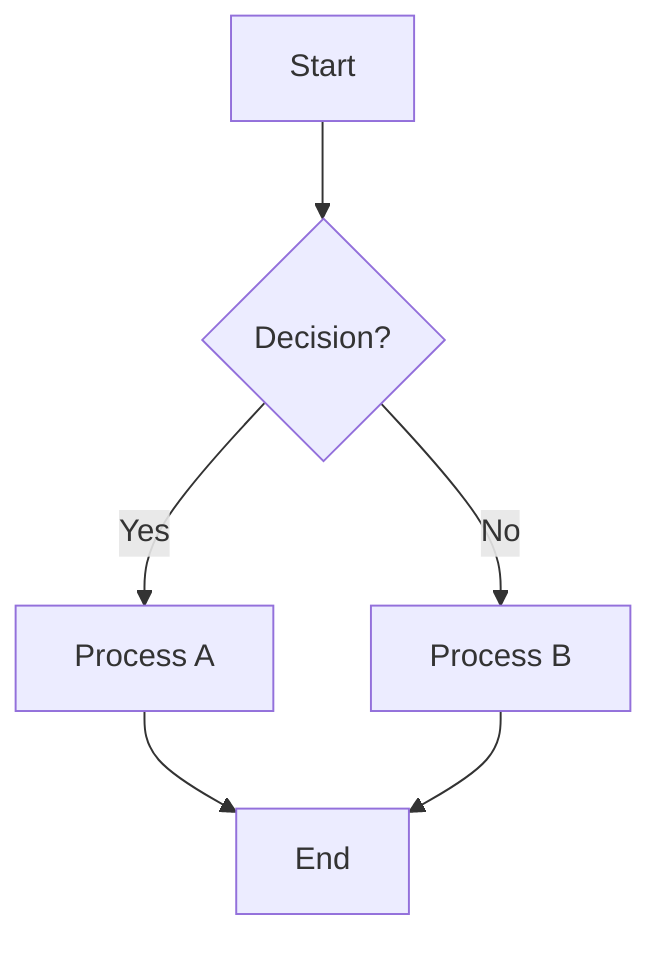
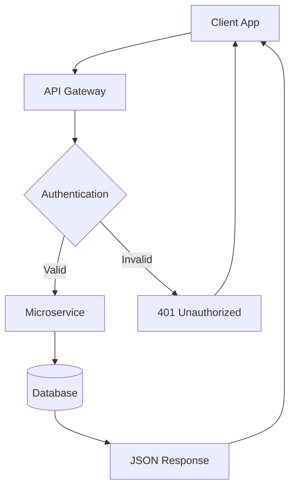
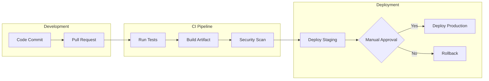
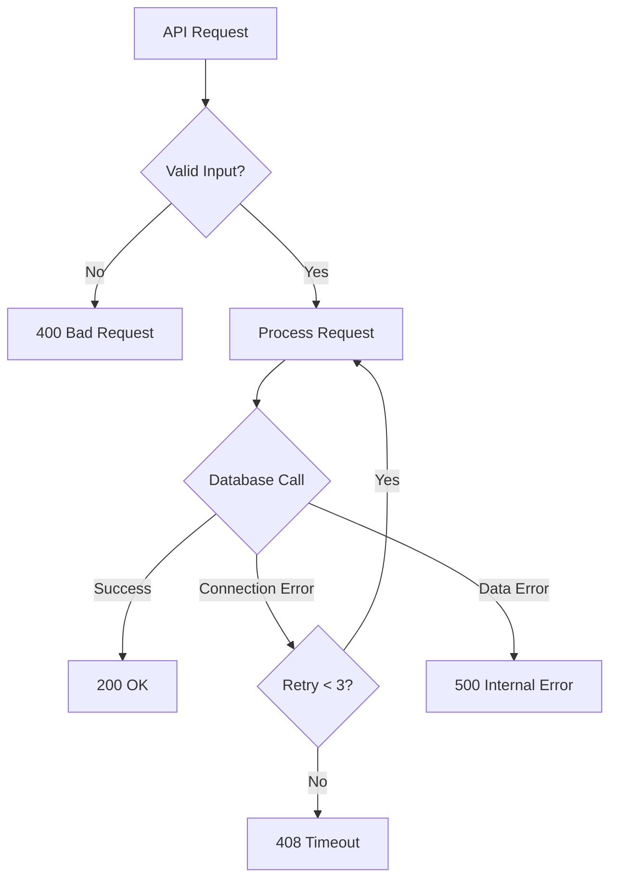
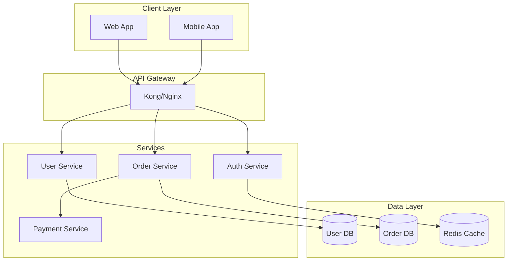
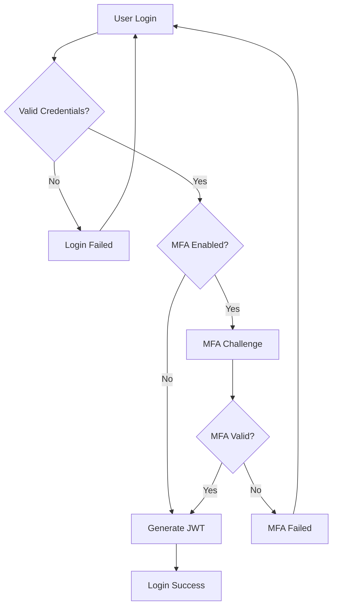
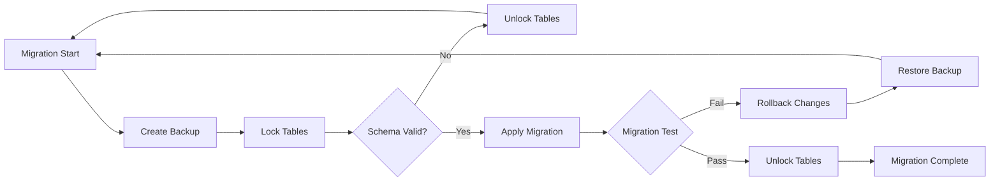

# Mermaid Flowchart Skill

*Tech-focused flowchart creation with official Mermaid syntax*

## Purpose

This skill specializes in creating Mermaid flowcharts specifically for technical documentation, system design, and software development workflows. It combines official Mermaid syntax with best practices for visualizing complex technical processes.

## Core Capabilities

### Flowchart Types Supported
- **System Architecture**: Service interactions, component relationships
- **Code Flow**: Algorithm logic, function call sequences  
- **Decision Trees**: Conditional logic, branching scenarios
- **Deployment Pipelines**: CI/CD workflows, release processes
- **User Journeys**: Authentication flows, API request paths
- **Error Handling**: Exception flows, fallback mechanisms
- **Database Operations**: CRUD flows, transaction sequences

### Mermaid Syntax Mastery

#### Basic Structure


#### Direction Options
- `TD` / `TB` - Top to Bottom
- `BT` - Bottom to Top  
- `LR` - Left to Right
- `RL` - Right to Left

#### Node Shapes & Meanings
```mermaid
flowchart LR
    A[Rectangle - Process/Action]
    B(Rounded - Start/End Points)
    C{Diamond - Decision Point}
    D[(Database)]
    E[[Subroutine/Module]]
    F[/Parallelogram - Input\/]/
    G[\Inverted Parallelogram - Output\]
    H((Circle - Connector))
```

#### Advanced Features
- **Subgraphs**: Group related components
- **Styling**: Colors, themes, custom CSS
- **Links**: Clickable elements with URLs
- **Icons**: FontAwesome integration
- **Comments**: Documentation within diagrams

### Tech-Specific Patterns

#### API Request Flow


#### CI/CD Pipeline


#### Error Handling Flow


## Best Practices

### Technical Accuracy
- Use standard HTTP status codes in error flows
- Include proper authentication/authorization steps
- Show database transactions and rollback scenarios
- Represent async operations clearly
- Include monitoring and logging touchpoints

### Visual Design
- Group related processes in subgraphs
- Use consistent color schemes for similar components
- Add meaningful labels to decision points
- Include timing information for critical paths
- Show both happy path and error scenarios

### Documentation Integration
- Always validate syntax before sharing
- Include diagram descriptions in surrounding text
- Link to related technical documentation
- Version control diagram sources
- Consider accessibility in color choices

## Common Use Cases

### 1. Microservices Architecture


### 2. Authentication Flow


### 3. Database Migration Process


## Validation & Preview

Always use the built-in Mermaid tools:
1. **Validate syntax**: Ensure error-free diagrams
2. **Preview rendering**: Check visual appearance  
3. **Test interactivity**: Verify clickable elements
4. **Accessibility check**: Confirm proper contrast and labeling

## Integration Guidelines

- Place flowcharts in technical documentation alongside code examples
- Use in architecture decision records (ADRs)
- Include in API documentation for request flows
- Add to runbooks for operational procedures
- Embed in code reviews for complex logic explanation

---

*"Clear diagrams prevent unclear implementations"*