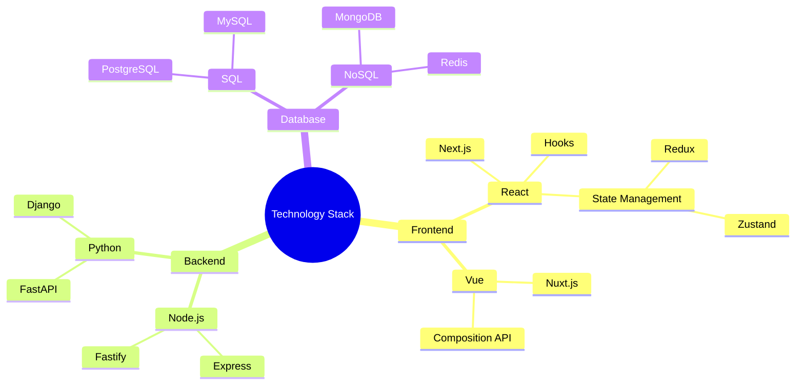
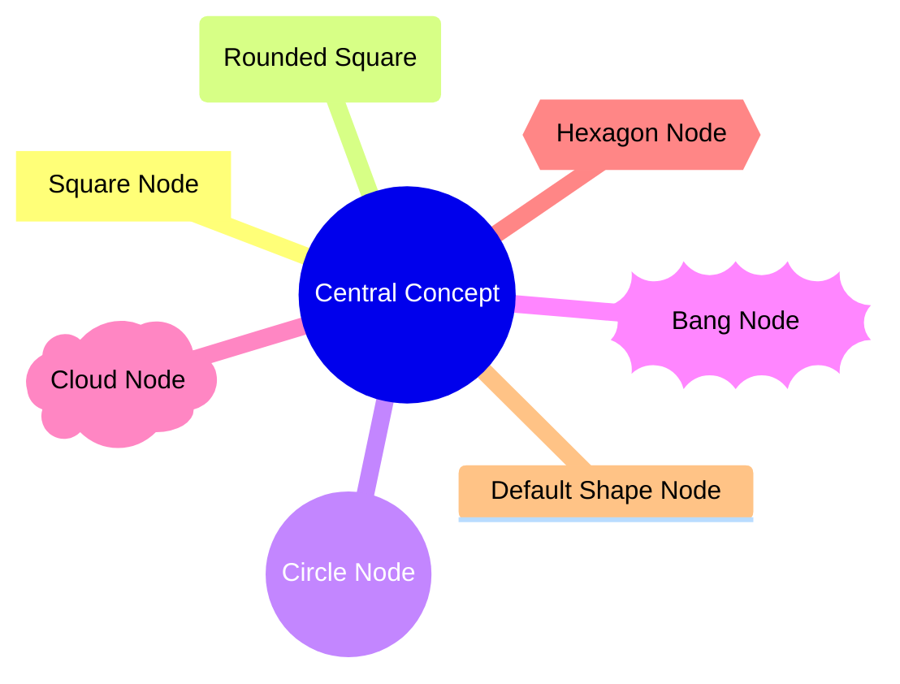
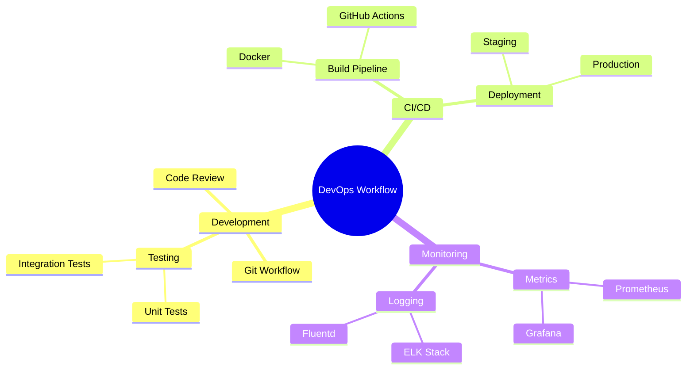
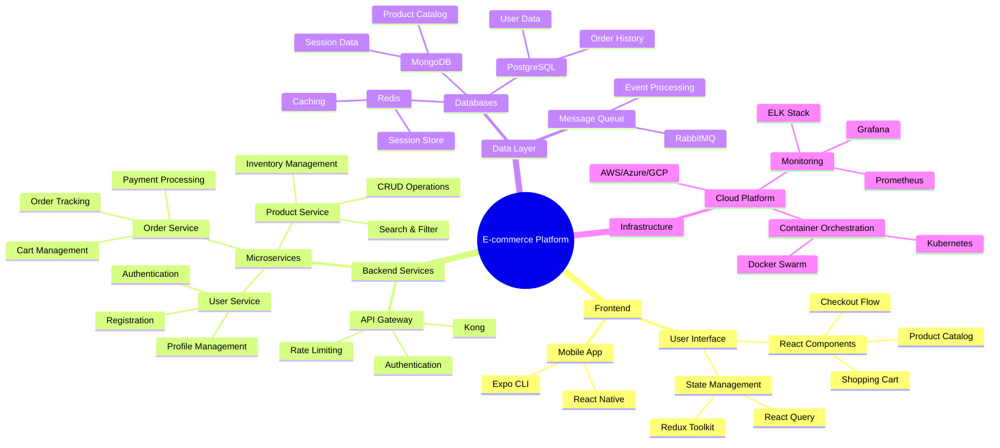
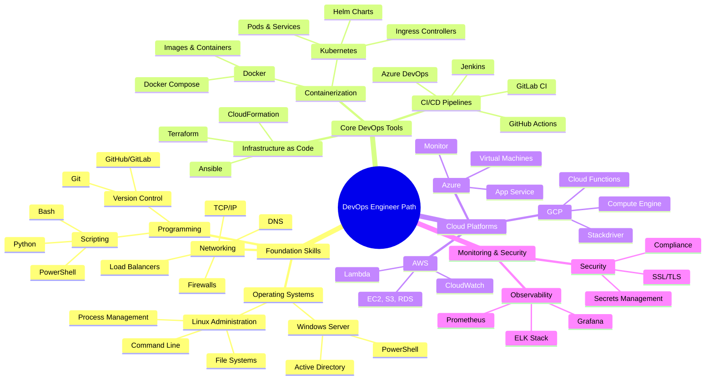
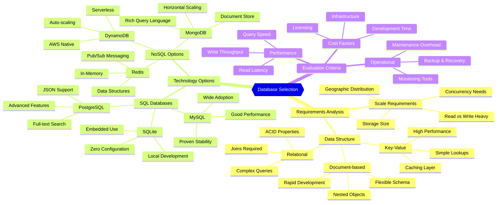
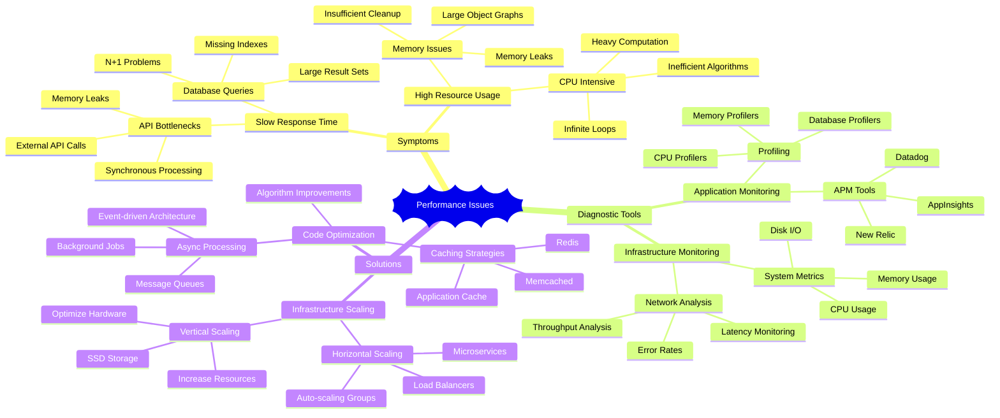
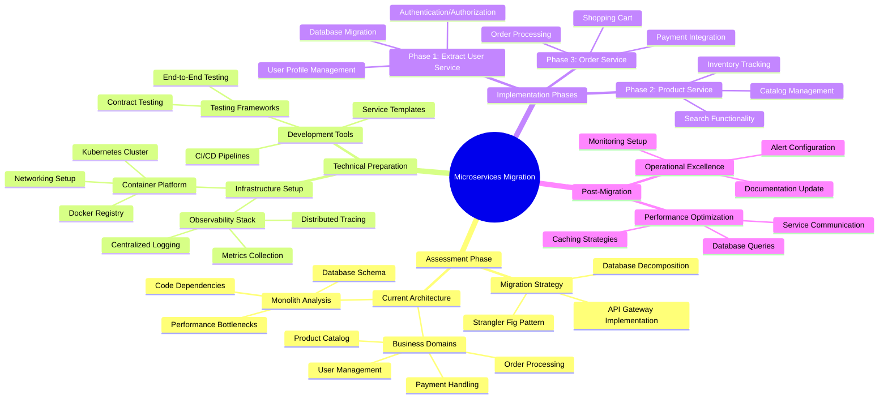
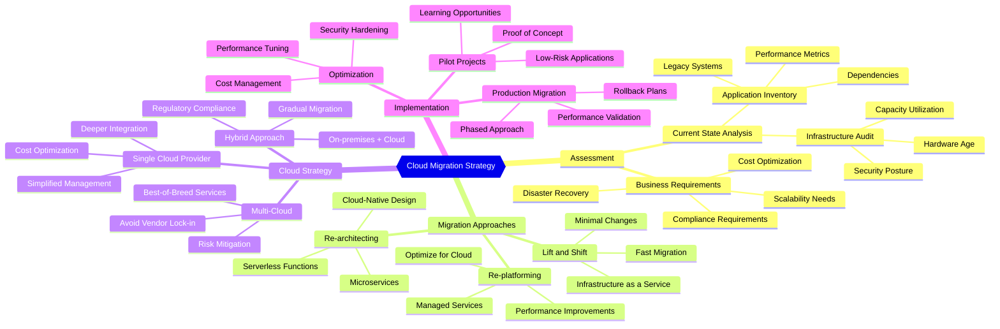

# Mermaid Mindmap Skill

*Tech-focused mindmaps for knowledge organization and system planning*

## Purpose

This skill specializes in creating Mermaid mindmaps that organize complex technical information into clear, hierarchical visual structures. Perfect for planning technology stacks, breaking down system architectures, and creating visual knowledge bases for technical concepts.

## Core Capabilities

### Mindmap Types Supported
- **Technology Stack Planning**: Framework selection, tool evaluation
- **System Architecture**: Component hierarchies, service dependencies
- **Feature Breakdown**: Epic → Story → Task decomposition  
- **Learning Paths**: Skill progression, certification tracks
- **Troubleshooting Guides**: Problem → Solution hierarchies
- **Project Planning**: Technical roadmaps, milestone organization
- **Knowledge Management**: Concept relationships, documentation structure
- **Decision Trees**: Technical choice evaluation

### Mermaid Mindmap Syntax Mastery

#### Basic Structure

#### Shape Variations

#### Advanced Features with Icons & Styling

### Tech-Specific Patterns

#### Full-Stack Application Architecture

#### Learning Path: Becoming a DevOps Engineer

#### Technology Decision Framework

#### Troubleshooting Guide: Application Performance

#### Project Planning: Microservices Migration

#### Cloud Migration Planning

## Best Practices

### Structure & Organization
- Start with a clear central concept
- Use logical hierarchical grouping
- Maintain consistent indentation
- Balance depth vs breadth for readability

### Visual Design
- Choose appropriate shapes for different concepts
- Use icons to enhance understanding (FontAwesome)
- Apply consistent styling within domains
- Consider color coding for categories

### Technical Accuracy
- Reflect real-world relationships accurately
- Include relevant technical details
- Show both horizontal and vertical dependencies
- Consider operational aspects like monitoring and security

### Content Strategy
- Focus on actionable information
- Include decision criteria where relevant
- Show alternative paths and options
- Link to detailed documentation

## Integration Guidelines

### Documentation
- Use in technical specifications
- Include in architecture decision records
- Add to onboarding materials
- Create visual table of contents

### Planning & Strategy
- Include in project kickoff meetings
- Use for technology selection processes
- Add to quarterly planning sessions
- Create visual roadmaps

### Knowledge Management
- Build technical competency maps
- Create troubleshooting decision trees
- Organize learning resources
- Map system dependencies

## Validation & Refinement

1. **Syntax Validation**: Ensure proper Mermaid formatting
2. **Logical Review**: Verify hierarchical relationships make sense
3. **Completeness Check**: Ensure all relevant concepts are included
4. **Accessibility**: Test with screen readers and assistive technology
5. **Maintenance**: Keep content current with technology changes

---

*"Mindmaps transform complex technical landscapes into navigable territories"*