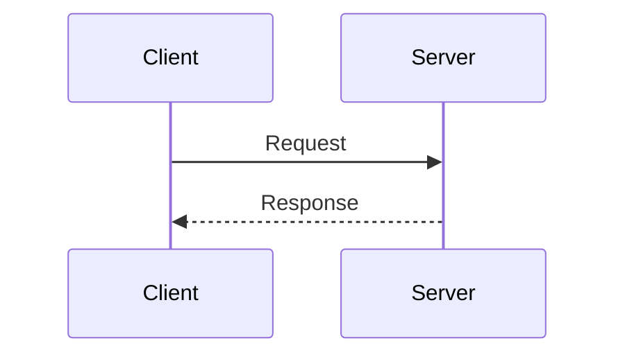
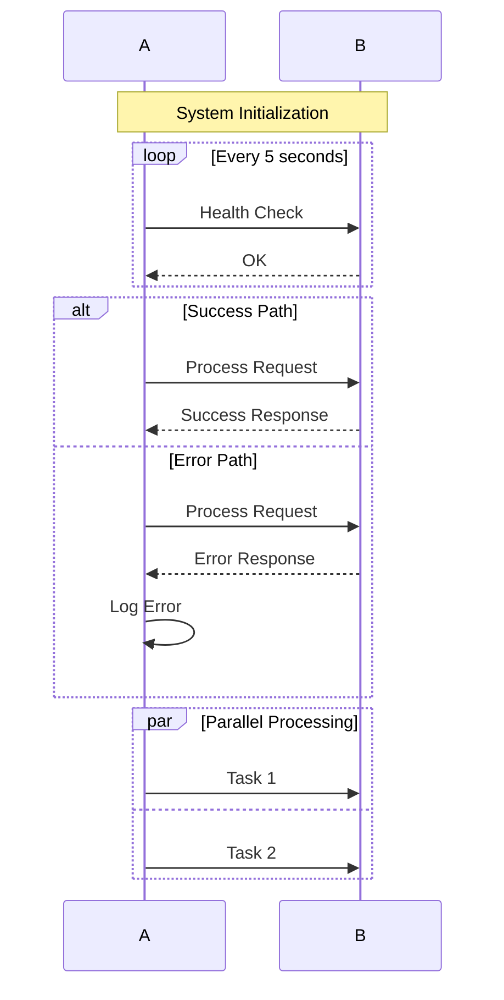
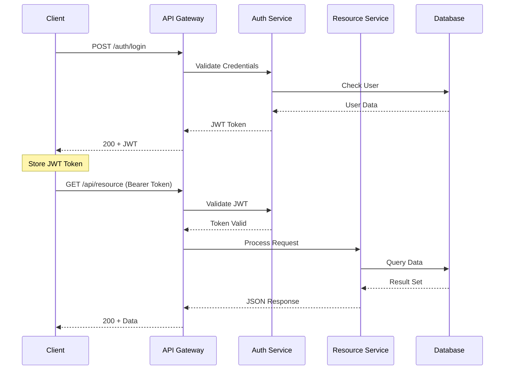
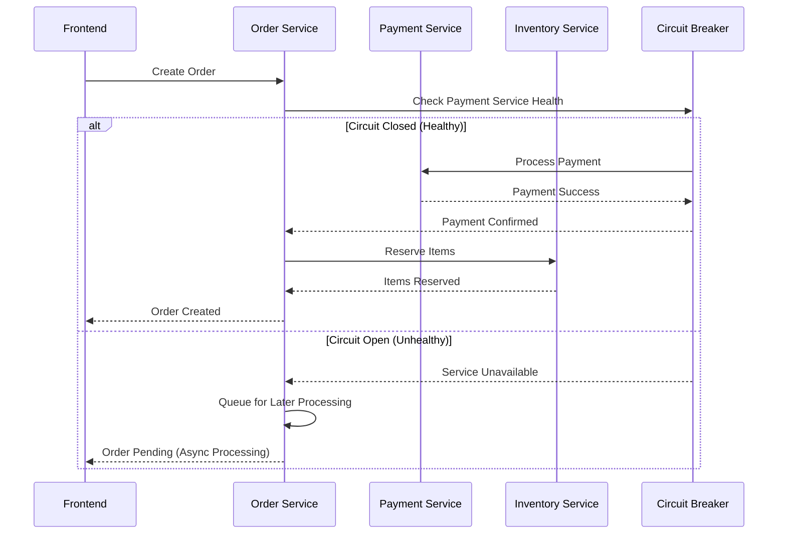
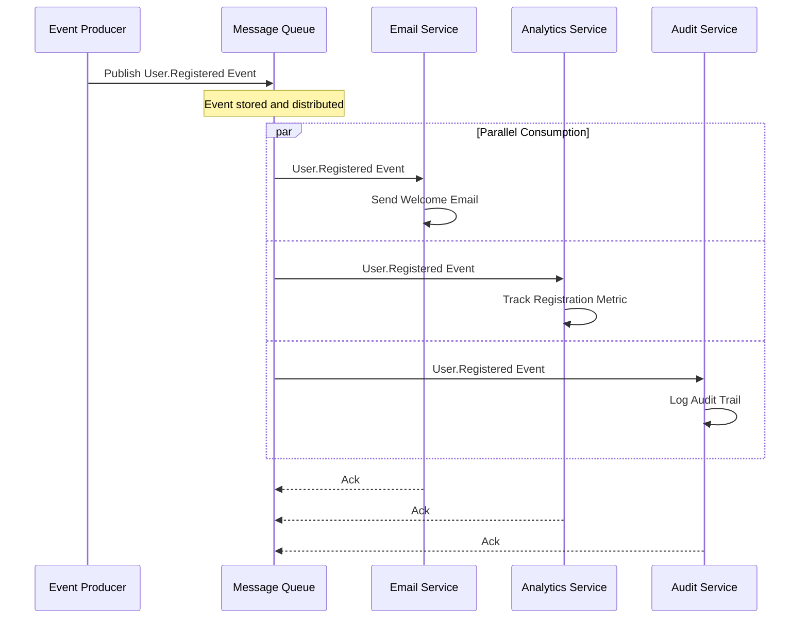
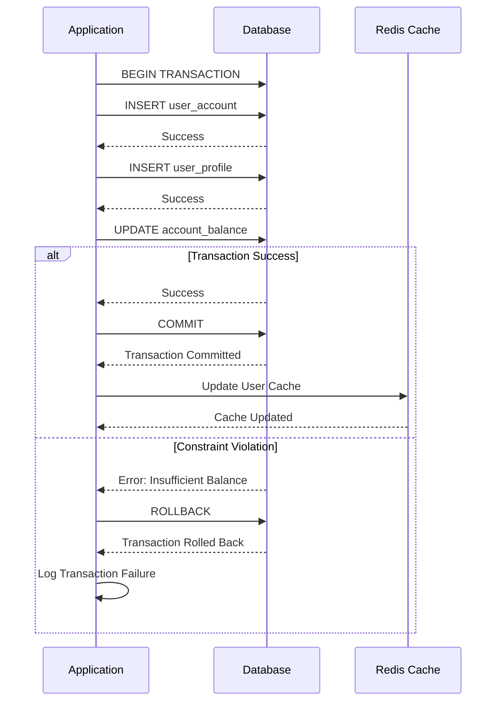
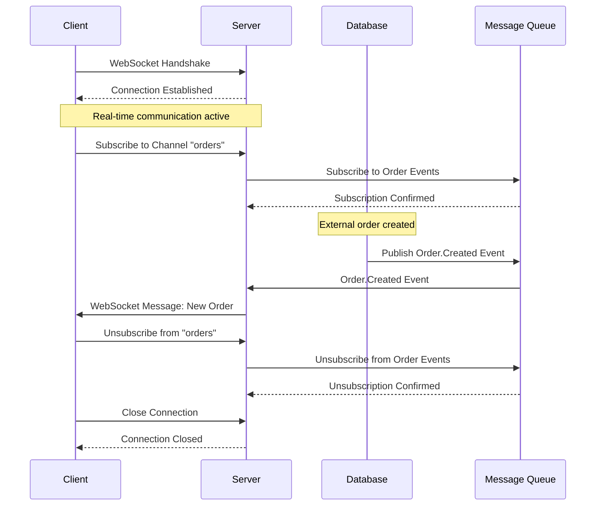
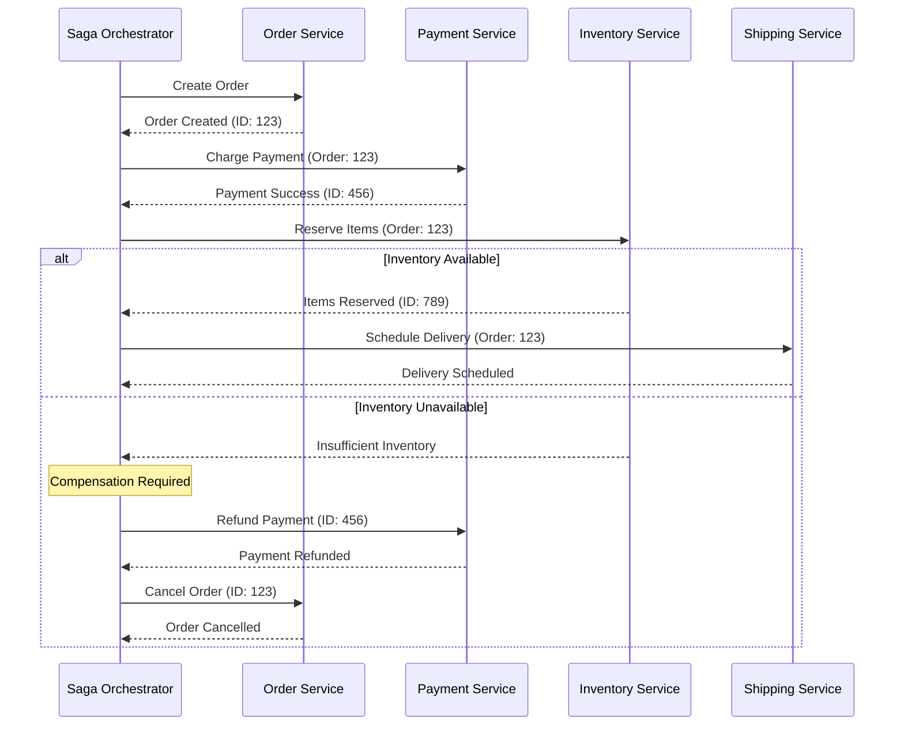

# Mermaid Sequence Diagram Skill

*Tech-focused sequence diagrams for system interactions*

## Purpose

This skill specializes in creating Mermaid sequence diagrams that clearly illustrate complex technical interactions, API communications, and system behaviors over time. Perfect for documenting distributed systems, microservice architectures, and integration patterns.

## Core Capabilities

### Sequence Diagram Types Supported
- **API Interactions**: REST, GraphQL, gRPC communications
- **Microservice Flows**: Service-to-service messaging
- **Authentication Sequences**: OAuth, JWT, SAML flows
- **Database Transactions**: ACID operations, distributed transactions
- **Message Queue Patterns**: Pub/sub, event streaming
- **WebSocket Communications**: Real-time bidirectional flows
- **Integration Patterns**: ESB, event sourcing, CQRS
- **Error Handling**: Timeout scenarios, circuit breaker patterns

### Mermaid Sequence Syntax Mastery

#### Basic Structure


#### Participant Types
```mermaid
sequenceDiagram
    participant Client
    actor User
    participant API as API Gateway
    participant Auth as Auth Service
    database DB as PostgreSQL
```

#### Arrow Types & Meanings
- `->>` : Solid arrow (synchronous call)
- `-->>` : Dashed arrow (response/return)
- `-x` : Solid arrow with X (lost message)
- `--x` : Dashed arrow with X (lost response)  
- `-)` : Solid arrow with open circle (async call)
- `--)` : Dashed arrow with open circle (async response)

#### Advanced Features


### Tech-Specific Patterns

#### REST API Authentication Flow


#### Microservice Communication with Circuit Breaker


#### Event-Driven Architecture with Message Queue


#### Database Transaction with Rollback


#### WebSocket Real-time Communication


#### Distributed System with Saga Pattern


## Best Practices

### Technical Accuracy
- Use proper HTTP status codes and method names
- Include realistic error scenarios and timeouts
- Show both synchronous and asynchronous patterns
- Represent database transactions accurately
- Include security considerations (tokens, encryption)

### Documentation Standards
- Define all participants clearly at the top
- Use meaningful participant aliases
- Add notes for complex logic sections
- Group related interactions with boxes
- Show timing constraints where relevant

### Performance Considerations
- Highlight potential bottlenecks
- Show caching strategies
- Include retry and circuit breaker patterns
- Document async vs sync trade-offs
- Consider scalability implications

## Integration Guidelines

### API Documentation
- Include in OpenAPI/Swagger specifications
- Show complete request/response cycles
- Document error handling patterns
- Illustrate authentication flows

### Architecture Documentation  
- Use in system design documents
- Include in technical specifications
- Add to integration guides
- Document for troubleshooting guides

### Development Workflow
- Include in code reviews for complex features
- Use in debugging sessions
- Add to incident post-mortems
- Document for onboarding new developers

## Validation & Testing

Always validate your sequence diagrams:
1. **Syntax validation**: Ensure proper Mermaid syntax
2. **Logic verification**: Check message flow accuracy  
3. **Error path coverage**: Include failure scenarios
4. **Performance review**: Consider timing implications
5. **Security audit**: Verify no sensitive data exposure

---

*"Sequence diagrams reveal the hidden conversations between systems"*